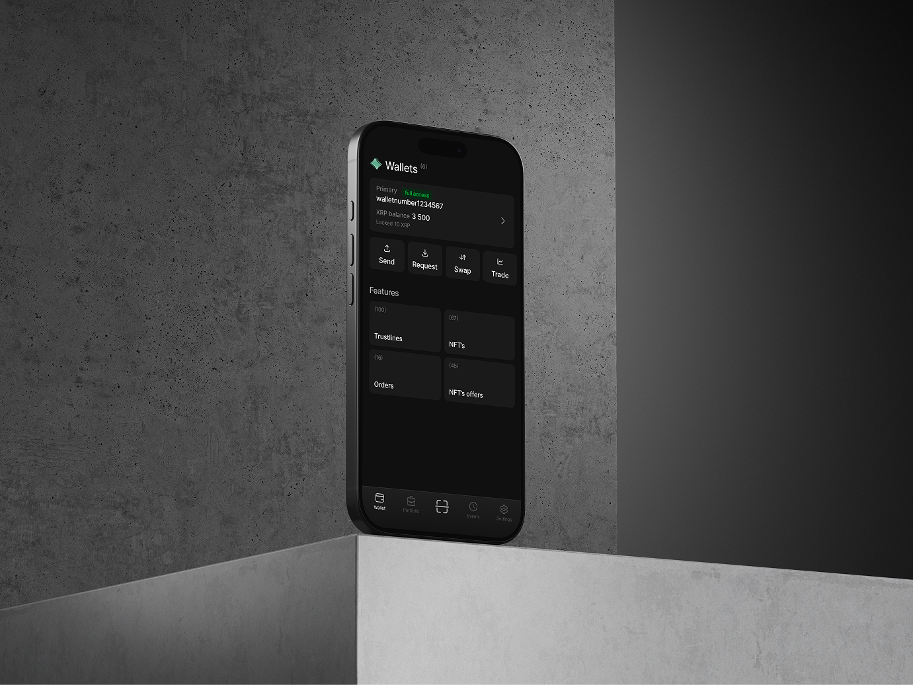
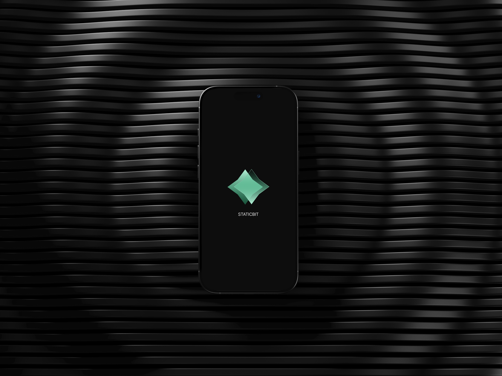
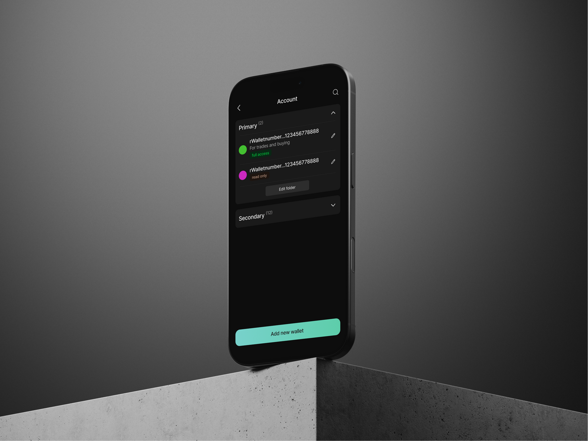

  

<h1 align="center">StaticBit</h1>

<b>Products and open-source infrastructure for the XRP Ledger</b>

## 💼 StaticBit Wallet — our flagship

A non-custodial, cross-platform wallet for the XRP Ledger.

- 📱 **Android · iOS · Windows** — one native app, built with .NET MAUI + Blazor Hybrid
- 🔗 **WalletConnect v2** — connect to any XRPL dApp
- 🔐 Keys never leave your device
- ⚙️ Runs on the same open-source SDK we ship below — we use what we build

  
  
  

  
  &nbsp;
  
  &nbsp;
  

## 🛠️ Open Source

| | |
|---|---|
| 🧩 [**XrplCSharp**](https://github.com/StaticBit-io/XrplCSharp) | **The** C# SDK for the XRP Ledger — 83 transaction types, binary codec, local signing, 57k+ downloads. First SDK to ship XLS-68 Sponsorship and Confidential MPT support. `dotnet add package Xrpl` |
| 🤖 [**staticbit-xrpl-mcp**](https://github.com/StaticBit-io/staticbit-xrpl-mcp) | XRPL MCP server + plugin marketplace — safe, scoped ledger tools for AI agents (Claude, GPT, any MCP client) |
| 🗺️ [**XrplCommons**](https://github.com/StaticBit-io/XrplCommons) | .NET client for the XRPL Commons Map API |
| 🔤 [**text-to-wallet**](https://github.com/StaticBit-io/staticbit-text-to-wallet) | Deterministic XRPL wallets from text passphrases |

## 🤖 Where AI agents meet XRPL

Agents need hands and a wallet — we build both:

- ⚡ **x402 agentic payments** — HTTP-402 flows: your agent pays for APIs in XRP/RLUSD autonomously, with hard spending caps
- 🛰️ **MCP servers** — ledger queries, token data and signing as safe, scoped tools for any MCP-capable agent
- 🧩 A protocol-complete SDK under it all

## 📡 Protocol coverage

XLS-56 Batch · XLS-65 Vault · XLS-66 Lending · XLS-68 Sponsored Fees & Reserves · XLS-75 Permission Delegation · XLS-96 Confidential MPT · x402

New amendments land here fast: XLS-68 support shipped the same day rippled merged it — verified against a live develop-branch validator.

---

  🌐 <a href="https://staticbit.io">staticbit.io</a> ·
  📦 <a href="https://www.nuget.org/packages/Xrpl">NuGet</a> ·
  📚 <a href="https://staticbit-io.github.io/XrplCSharp/">SDK Docs</a>

